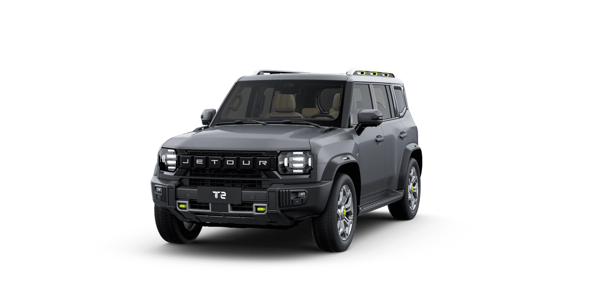

# 🎨 AD-AI Generator - Streamlit Edition

Generate beautiful advertisements with AI-powered color recommendations using a modern web interface!

## 🚀 Quick Start

### 1. Install Dependencies
```bash
pip install -r requirements.txt
```

### 2. Set up Environment
Create a `.env` file with your OpenAI API key:
```
OPENAI_API_KEY=your-openai-api-key-here
```

### 3. Run the BE Application
```bash
python main.py 
```

### 4. Run the Streamlit as FE Application
```bash
streamlit run streamlit/app.py
```


This will start:
- **FastAPI Backend**: http://localhost:8000
- **Streamlit Frontend**: http://localhost:8501

## 📱 How to Use

1. **Upload Image**: Upload a product image (PNG, JPG, JPEG, WEBP)
2. **Enter Details**: Provide product name and brand name
3. **Choose Colors**:
   - 🤖 **AI Recommendations**: Let AI analyze your image and suggest optimal colors
   - 🎯 **Manual Selection**: Choose your own colors (1-3 colors max)
4. **Generate**: Create your advertisement!
5. **Download**: Get your generated ad as a JPG file

## 📸 Examples

### Input vs Output

| Input Product Image | Generated Advertisement |
|-------------------|----------------------|
|  |  |
|  |  |
|  |  |


## 🛠️ Manual Setup (Alternative)

If you prefer to run services separately:

### Start FastAPI Backend
```bash
python main.py
```

### Start Streamlit Frontend (in another terminal)
```bash
streamlit run streamlit/app.py
```

## 🎨 Features

- **Smart Color Analysis**: AI analyzes product images to recommend optimal colors
- **Manual Color Control**: Choose specific colors and quantities
- **Real-time Preview**: See your uploaded image and color selections
- **Download Ready**: Get high-quality advertisement images
- **Clean Interface**: Modern, intuitive Streamlit UI

## 📁 Project Structure

```
BE/
├── main.py              # FastAPI backend
├── streamlit/app.py     # Streamlit frontend
├── src/ad_generator.py  # Core AI functionality
├── requirements.txt    # Dependencies
└── README.md          # This file
```

## 🔧 API Endpoints

- `POST /upload-image` - Upload product image
- `POST /recommend-colors` - Get AI color recommendations
- `POST /generate-ad` - Generate advertisement
- `GET /download/{filename}` - Download generated ad
- `DELETE /cleanup/{file_id}` - Clean up temporary files

## 💡 Tips

- Use high-quality product images for best results
- Experiment with both AI and manual color selection
- AI recommendations work best with clear product photos
- Generated ads are optimized for social media (1:1 aspect ratio)

## 🐛 Troubleshooting

- Make sure your OpenAI API key is valid and has sufficient credits
- Ensure both services are running before using the Streamlit interface
- Check the console output for any error messages 